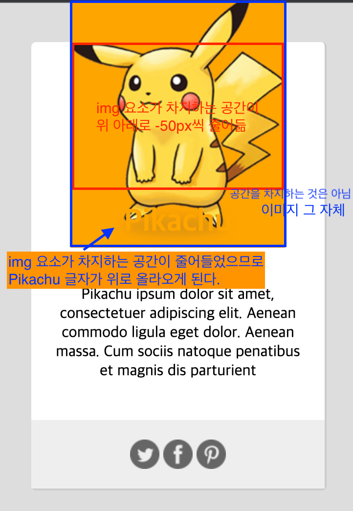

# 📝 CSS

-   오늘의 한 마디

## 📎 Text

-   block level element와 inline element
-   유연하면서도 레이아웃이 깨지지 않게 노력하기

    -   button 요소에 width와 padding을 넣었을 때 차이

-   window.devicePixelRatio

-   text-decoration은 font-family의 형태에 따라 라인이 잘리는 경우가 있다.

    -   주로 앵커태그에서 사용된다. (밑줄 없애기)

-   앵커 태그의 디자인은 웹 접근성을 고려

-   CSS에서 웹 표준이 아니라는 말은 브라우저마다 다르게 동작할 수 있다는 의미

-   Deprecated는 예전에 사용했지만 더 이상 권장하지 않음

## 📎 position

-   absolute 위치는 position:static을 제외한 다른 속성값을 가진 가장 가까운 부모 요소를 기준으로 자리를 잡는다.

-   웹은 3차원

## 📎 Float

-   inline 요소에 float 속성을 주면 block으로 바뀐다.

## 📝 CSS 특강

-   타입셀렉터보다는 클래스를 사용해주자.

-   큰 레이아웃부터 잡기

-   레이아웃 잡은 뒤 초기화 진행하기

-   line-height를 키우면 font-size는 그대로이며, Half Lead가 커진다.
    -   line-height는 폰트마다 크기가 다르므로 폰트 사이즈를 10px를 주고 개발자 도구에서 찍어보면 길이를 잴 수 있다.
    -   line-height는 기본적으로 normal이며 배수는 정수로 준다.
        -   line-height :2은 폰트 사이즈 2배이다. 만약 line-height :1로 주면 leading area가 사라져서 폰트 사이즈랑 동일하게 나온다.
-   negative margin을 주면 이미지가 차지하는 공간과 보여주는 영역을 분리해서 사용할 수 있다.

    -   시작점과 끝나는 점이 달라져서 뒤에 오는 요소들의 위치가 같이 조정된다.
    -   겹침을 활용할 수 있다.
        

-   active, on, selected, highlight, done 등 의미가 있는 클래스 사용
